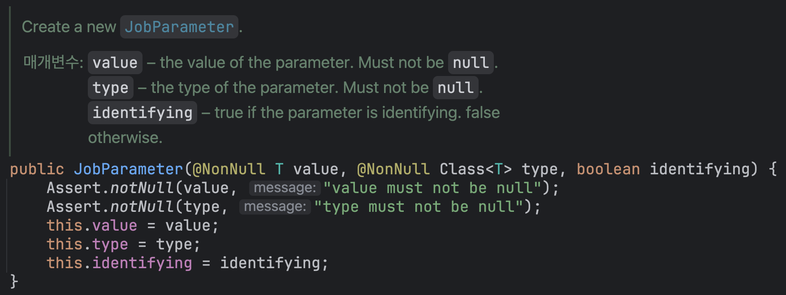
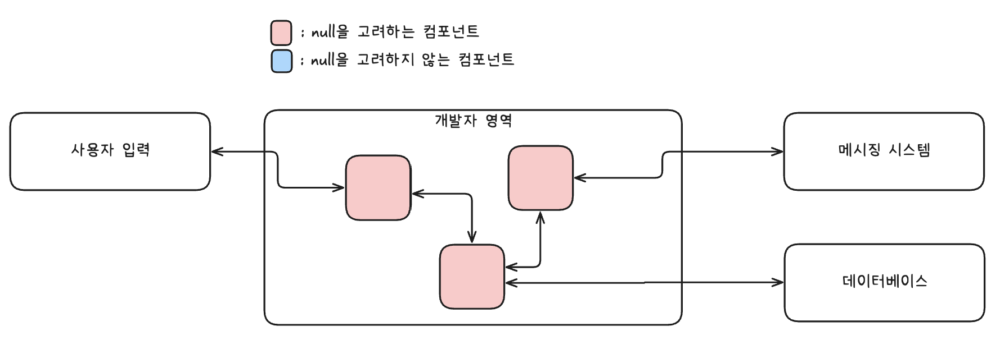
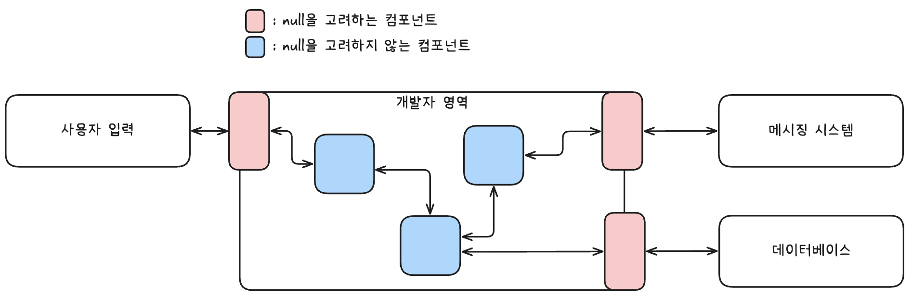

# 자바에서 null은 어떻게 처리되어야 할까?

자바에서는 모든 참조 타입 변수에 null이 할당될 수 있다.
이 특징에 의해 생기는 위험성과 불명확함이 존재한다.

```java
String concat(String a, String b);
```

위 메서드의 예시에서 `a`이나 `b`는 null이 될 수 있을까?라는 의문이 들게 된다.
내부 구현도 여러가지 방식이 존재할 수 있다.

**케이스 1: null 가능성을 고려하지 않은 구현**
```java
String concat(String a, String b) {
    return a + b;
}
```

**케이스 2: null 가능성을 고려하여 적절한 값으로 응답하는 구현**
```java
String concat(String a, String b) {
    if (a == null) return b;
    if (b == null) return a;

    return a + b;
}
```

**케이스 3: null 가능성을 고려하여 예외를 던지는 구현**
```java
String concat(String a, String b) {
    if (a == null || b == null) throw new IllegalArgumentException("parameter cannot be null");

    return a + b;
}
```

이런 수많은 가능성 속에서 개발자들은 해당 메서드의 내부 구현을 보거나, 주석을 읽어야 한다.
다른 언어들에서는 어떨까?

### 코틀린

코틀린에서는 기본적인 타입은 모두 null이 불가하게 설계되어 있고, null이 넘어올 수 있음을 명시적으로 나타낸다.

**케이스 1: null이 들어올 수 없는 경우**
```kotlin
fun concat(a: String, b: String): String {
    return a + b
}
```

**케이스 2: null이 들어올 수 있는 경우**
```kotlin
fun concat(a: String?, b: String?): String {
    return (a ?: "") + (b ?: "")
}
```

## 주장 1. null 가능성은 명확하게 나타내야 한다.

메서드 시그니처만으로도 판단을 할 수 있으므로, 자바에서처럼 내부 구현을 보거나 주석을 읽는 비용이 줄어든다.
자바에서도 이럴 수는 없을까?

### JSR-305

자바 진영에서는 이 이슈가 오랜 기간 재기되어왔고, 이에 따른 유명한 요청이 [JSR-305](https://jcp.org/en/jsr/detail?id=305)이다.
요약하면, `javax.annotation.Nonnull`, `javax.annotation.Nullable`의 애노테이션을 활용하여 null 가능성을 표현하겠다는 것이다.

**케이스 1: null이 들어올 수 없는 경우**
```java
String concat(@Nonnull String a, @Nonnull String b) {
    return a + b;
}
```

**케이스 2: null이 들어올 수 있는 경우**
```java
String concat(@Nullable String a, @Nullable String b) {
    if (a == null) return b;
    if (b == null) return a;

    return a + b;
}
```

이 API는 당시 빠르게 퍼져나갔지만, 결론적으로는 폐기되었다.

### JSR-305 계열의 애노테이션들


*그림 1: 다양한 NonNull 애노테이션 구현체들*

JSR-305는 실패했지만, 그 이후로 비슷한 계열의 다른 애노테이션들이 우후죽순 생겨났다.
대표적으로는 `org.jetbrains.annotations.Nullable`과 `org.springframework.lang.Nullable` 등이 존재한다.
`org.jetbrains.annotations.Nullable`는 Jetbrains의 IDE에서 지원되며, 경고/힌트를 띄워주는 역할이며, `org.springframework.lang.Nullable`는 스프링 프레임워크에서 제공하며, 동일한 역할을 수행한다.
Intellij IDEA, 정적 분석 도구들은 JSR-305를 포함하여 이러한 애노테이션들을 분석하고, 경고/힌트를 띄워준다.

### 하지만 여전히 채택되지 못하고 있다.

이런 애노테이션들은 명확하지만, 여전히 수많은 자바 베이스 코드에서는 채택되지 못하고 있다.
그 이유는 다음과 같다.

- 언어 차원의 강제력 부재 : 결국 위 애노테이션들은 '힌트'일 뿐, 강제되지 않는다. 강제력이 없으니 쓰는 이유가 반감된다.
- 애노테이션 난립 : JSR-305 계열의 애노테이션들이 너무 많다보니, 자바 생태계에서 무엇을 사용해야 하는지 확립되지 못했다.
- 언어적 문화의 한계 : 자바 개발자들은 이미 수년간 개발하며 이런 불명확함에 익숙해졌다.

이러한 이유들로 인해, 많은 자바 개발자들은 애노테이션을 사용하여 null 가능성을 명확하게 나타내는 것을 포기했다.

다만 이러한 이유들은 null 가능성 표현의 본질적 가치를 간과한다. 애노테이션의 핵심은 '표현력' 제공이지, '강제성' 부여가 아니기 때문이다. 따라서 JSR-305든 다른 계열이든 애노테이션을 활용하면 충분한 표현력을 제공받을 수 있고, 이를 통해 주석이나 내부 구현을 읽지 않아도 사용할 수 있는 API를 설계할 수 있다.


*그림 2: Spring Framework에서의 @NonNull 사용 예시*

이러한 관점의 개발자들은 다음과 같은 시스템을 구축한다.


*그림 3: null을 메시지로 보는 관점의 시스템 구조*

## 주장 2. null 가능성은 명확하게 나타내지 않아도 된다.

아니면 다른 관점으로, null이 넘어오는 상황 자체를 고려하지 않을 수도 있다.
이 주장의 논지는 **null은 오류**라는 것이다. 마치 정상적인 숫자 계산에서 잘못된 입력값을 고려할 필요가 없는 것처럼, null 역시 고려 대상이 아니다. 다시 말해, 모든 파라미터에 `@Nonnull`이 붙어있는 것이 당연하다는 관점이다.
따라서 개발자가 구축한 시스템 안에서 null은 넘어오면 안 된다.

이러한 주장의 개발자들은 다음과 같은 코드를 작성한다.

```java
String concat(String a, String b) {
    return a + b;
}
```

물론 이는 개발자가 만든 영역에서만 유효하기 때문에, 외부 시스템과 연결될 때에는 null 가능성을 고려하고, 방어적으로 개발해야 한다. 이를 위해서는 외부 시스템과 연결되는 지점에 null 가능성 완충지대를 만들어야 한다.


*그림 4: null을 오류로 보는 관점의 시스템 구조*

## 두 주장의 시스템 비교

| 구분 | null을 오류로 보는 시스템 | null을 메시지로 보는 시스템 |
|------|-------------------------|---------------------------|
| **장점** | • 코드양 감소: null을 고려하지 않아도 되므로 코드가 간결함<br>• 명확성 향상: 애노테이션이나 분기처리가 줄어듦 | • 안전성과 명시성: 코드가 비교적 안전하며 의도가 명확함<br>• 시스템 분리 용이: 내부 컴포넌트를 다른 시스템으로 분리해도 안전함 |
| **단점** | • 언어 수준 방어 부재: null이 오류라는 것은 관점일 뿐, 언어 차원에서 강제되지 않음<br>• 주석 필수: API에는 주석 작성이 사실상 필수<br>• 시스템 분리 복잡: 분리 시 완충지대 추가 개발 필요 | • 가독성 저하: 명시적이기 위한 애노테이션으로 인해 가독성이 다소 떨어짐 |

결국 두 주장은 장단이 뚜렷하며, 선택은 팀적 합의에 의해 이루어져야 한다.

## 응답값에서의 null 처리

지금까지는 메서드 **파라미터**의 null 처리를 다루었다. 하지만 null 문제는 **응답값(반환값)**에서도 동일하게 발생한다. 같은 논리를 응답값에도 적용해보자.

```java
String getEmail();
```

만약 이메일이 없다면 응답값은 null이 되어야 할까? 아니면 빈값? 또는 예외가 발생할 수도 있다. 이 또한 내부 구현을 보아야 한다.

**케이스 1: null 응답**
```java
String getEmail() {
    return this.email;
}
```

**케이스 2: 빈값 응답**
```java
String getEmail() {
    if (this.email == null) return "";
    return this.email;
}
```

**케이스 3: 예외 발생**
```java
String getEmail() {
    if (this.email == null) throw new IllegalStateException("email is null");
    return this.email;
}
```

첫번째 주장의 개발자들은 파라미터에서 그렇듯, 응답값에도 애노테이션을 활용한다.
다음은 그들의 코드 예시이다.

```java
@Nullable String getEmail() {
    return this.email;
}
```

```java
@Nonnull String getEmail() {
    if (this.email == null) return "";
    return this.email;
}
```

```java
@Nonnull String getEmail() {
    if (this.email == null) throw new IllegalStateException("email is null");
    return this.email;
}
```

두 번째 주장(null을 오류로 보는 관점)의 개발자들은 응답값을 다룰 때 딜레마에 직면한다. 메서드가 객체의 **상태(필드)**에 의존하지 않는 경우는 간단하지만, 상태에 의존하는 경우 그 상태 자체가 null일 수 있기 때문이다.

예를 들어, 두 번째 주장의 개발자들은 다음과 같은 메서드를 쉽게 작성할 수 있다. (static 키워드는 상태에 의존하지 않음을 나타낸다.)

```java
static int sum(int a, int b) {
    return a + b;
}
```

하지만 위의 `getEmail()` 예시에서는 상황이 복잡해진다. return 문만을 남겨두고 싶겠지만, 유저의 이메일이 null이 될 수 있기 때문이다. 이런 경우 2가지 방법 중 하나를 택하게 된다.

#### 주장 2-1. 애초에 상태가 null이 되는 것이 불가능해야 한다는 주장

```java
class User {
    String email;
    String gender;

    User(String email) {
        this.email = email;
    }

    User(String email, String gender) {
        this.email = email;
        this.gender = gender;
    }

    String getEmail() {
        return this.email;
    }

    String getGender() {
        return this.gender;
    }
}
```

위 코드 예시에서 생성자에서 무조건 email을 받기 때문에, 상태가 null이 아니라고 단정지을 수 있다. 하지만 gender의 경우에는 항상 받지 않으므로, 상태가 null이 될 수 있다.
이 주장의 개발자들은 위와 같은 코드가 불완전하다고 생각하며, 개선되어야 한다고 말한다.

개선하는 방법은 여러가지이지만, 대표적으로는 추상화를 이용해볼 수 있다.

```java
class User {
    String email;

    User(String email) {
        this.email = email;
    }

    String getEmail() {
        return this.email;
    }
}

class GenderUser extends User {
    String gender;

    GenderUser(String email, String gender) {
        super(email);
        this.gender = gender;
    }

    String getGender() {
        return this.gender;
    }
}
```

이러면 각 클래스는 null을 응답하지 않음을 보장받을 수 있다.

#### 주장 2-2. 상태에 한정해서는 null 가능성을 고려해야 한다는 주장

이들은 null 가능성을 타협한 케이스이다. 따라서 상태를 null이 가능한 것과, 불가능한 것으로 나누고, 가능한 것에 한정해 방어적으로 개발한다.

```java
class User {
    String email;
    String gender;

    User(String email) {
        this.email = email;
    }

    User(String email, String gender) {
        this.email = email;
        this.gender = gender;
    }

    String getEmail() {
        return this.email;
    }

    String getGender() {
        if (this.gender == null) throw new IllegalStateException("gender is null");
        return this.gender;
    }
}
```

## 결론

자바에서 null 처리는 두 가지 관점으로 접근할 수 있다:

1. **null을 메시지로 보는 관점**: 애노테이션(`@Nullable`, `@Nonnull`)을 활용해 null 가능성을 명시적으로 표현한다. 코드가 안전하고 명시적이지만, 애노테이션으로 인한 가독성 저하가 있을 수 있다.

2. **null을 오류로 보는 관점**: 시스템 내부에서 null을 허용하지 않으며, 외부 경계에서만 방어적으로 처리한다. 코드가 간결하고 명확하지만, 언어 차원의 강제력이 없어 주석 작성이 필수적이다.

각 관점은 명확한 장단점이 있으며, **정답은 없다**. 팀의 상황과 시스템 특성에 맞는 방식을 **합의를 통해** 선택하고, 일관되게 적용하는 것이 중요하다.

중요한 것은 어떤 방식을 선택하든, 팀 전체가 동일한 원칙을 공유하고 지키는 것이다.