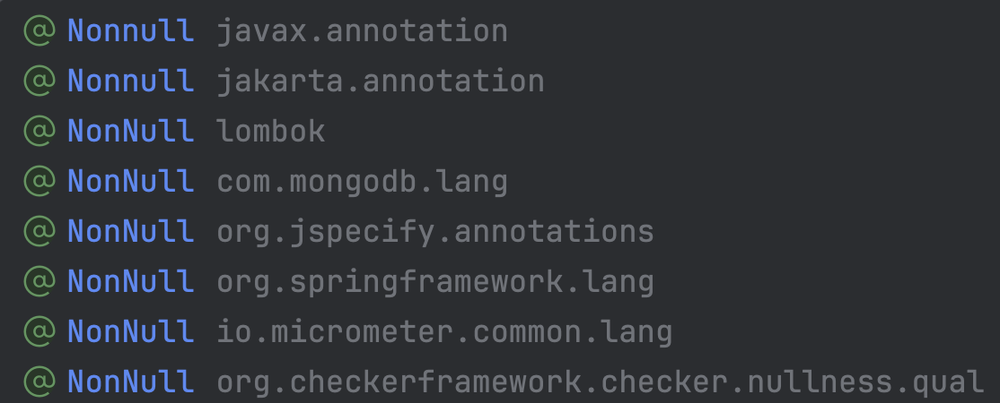

# 자바에서 null은 어떻게 처리되어야 할까?

자바에서는 모든 클래스 대신 null이 들어올 수 있다.
이 특징에 의해 생기는 위험성과 불명확함이 존재한다.

```java
String concat(String a, String b);
```

위 메서드의 예시에서 `a`이나 `b`는 null이 될 수 있을까? 란 의문이 들게 된다.
내부 구현도 여러가지 방식이 존재할 수 있다.

**null 가능성을 고려하지 않은 구현**
```java
String concat(String a, String b) {
    return a + b;
}
```

**null 가능성을 고려했고, 적절한 값으로 응답하는 구현**
```java
String concat(String a, String b) {
    if (a == null) return b;
    if (b == null) return a;

    return a + b;
}
```

**null 가능성을 고려했고, 예외를 던지는 구현**
```java
String concat(String a, String b) {
    if (a == null || b == null) throw new IllegalArgumentException("parameter cannot be null");

    return a + b;
}
```

이런 수많은 가능성 속에서 개발자들은 해당 메서드의 내부 구현을 보거나, 주석을 읽어야 한다.
다른 언어들에서는 어떨까?

### 코틀린

코틀린에서는 기본적인 타입은 모두 null이 불가하게 설계되어 있고, null이 넘어올 수 있음을 명시적으로 나타낸다.

**null이 들어올 수 없는 경우**
```kotlin
fun concat(a: String, b: String): String {
    return a + b
}
```

**null이 들어올 수 있는 경우**
```kotlin
fun concat(a: String?, b: String?): String {
    return (a ?: "") + (b ?: "")
}
```

## 주장 1. null 가능성은 명확하게 나타내야 한다.

메서드 시그니처만으로도 판단을 할 수 있으므로, 자바에서처럼 내부 구현을 보거나 주석을 읽는 비용이 줄어든다.
자바에서도 이럴 수는 없을까?

### JSR-305

자바 진영에서는 이 이슈가 오랜 기간 재기되어왔고, 이에 따른 유명한 요청이 [JSR-305](https://jcp.org/en/jsr/detail?id=305)이다.
요악하면, `javax.annotation.Nonnull`, `javax.annotation.Nullable`의 애노테이션을 활용하여 null 가능성을 표현하겠다는 것이다.

**null이 들어올 수 없는 경우**
```java
String concat(@Nonnull String a, @Nonnull String b) {
    return a + b;
}
```

**null이 들어올 수 있는 경우**
```java
String concat(@Nullable String a, @Nullable String b) {
    if (a == null) return b;
    if (b == null) return a;

    return a + b;
}
```

당시 이 API는 당시 빠르게 퍼져나갔지만, 결론적으로는 폐기되었다.

### JSR-305 계열의 애노테이션들



JSR-305는 실패했지만, 그 이후로 비슷한 계열의 다른 애노테이션들이 우후죽순 생겨났다.
대표적으로는 `org.jetbrains.annotations.Nullable`과 `org.springframework.lang.Nullable`등이 존재한다.
`org.jetbrains.annotations.Nullable`는 Jetbrains의 IDE에서 지원되며, 경고/힌트를 띄워주는 역할이며, `org.springframework.lang.Nullable`는 스프링 프레임워크에서 제공하며, 동일한 역할을 수행한다.
Intellij IDEA, 정적 분석 도구들은 JSR-305를 포함하여 이러한 애노테이션들을 분석하고, 경고/힌트를 띄워준다.

### 하지만 여전히 채택되지 못하고 있다.

이런 애노테이션들은 명확하지만, 여전히 수많은 자바 베이스 코드에서는 채택되지 못하고 있다.
그 이유는 다음과 같다.

- 언어 차원의 강제력 부재 : 결국 위 애노테이션들은 '힌트'일 뿐, 강제되지 않는다. 강제력이 없으니 쓰는 이유가 반감된다.
- 애노테이션 난립 : JSR-305 계열의 애노테이션들이 너무 많다보니, 자바 생태계에서 무엇을 사용해야 하는지 확립되지 못했다.
- 언어적 문화의 한계 : 자바 개발자들은 이미 수년간 개발하며 이런 불명확함에 익숙해졌다.

이런 이유들에 의하여, 많은 자바 개발자들은 애노테이션을 사용하여 null 가능성을 명확하게 나타내는 것을 포기했다.

다만 위 논리들은 이 글에서의 관점과는 잘 맞지 않는다. 우리는 '표현력'이 필요했던 것이지, '강제성'이 필요했던 것은 아니기 때문이다. 따라서 JSR-305든 다른 계열이든 애노테이션을 활용하면 충분한 표현력을 제공받을 수 있고, 이를 통해 주석이나 내부 구현을 읽지 않아도 사용할 수 있는 API를 설계할 수 있다.


이러한 관점의 개발자들은 다음과 같은 시스템을 구축한다.


## 주장 2. null 가능성은 명확하게 나타내지 않아도 된다.

아니면 다른 관점으로, null이 넘어오는 상황 자체를 고려하지 않을 수도 있다.
이 주장의 논지는 **null은 오류**라는 것이다. 구구단에서 `'' * '8'`을 고려할 필요는 없는 것이다. 마치 모든 파라미터에 `@Nonnull`이 붙어있는게 당연하다는 관점이다.
따라서 개발자가 구축한 시스템 안에서 null은 넘어오면 안된다.

이러한 주장의 개발자들은 다음과 같은 코드를 작성한다.

```java
String concat(String a, String b) {
    return a + b;
}
```

물론 이는 개발자가 만든 영역에서만 유효하기 때문에, 외부 시스템과 연결될 때에는 null 가능성을 고려하고, 방어적으로 개발해야 한다. 이를 위해서는 외부 시스템과 연결되는 지점에 null 가능성 완충지대를 만들어야 한다.


## 두 주장의 시스템 비교

**null을 오류로 보는 시스템**
- 장점
  - 개발자 영역 내부의 컴포넌트는 null을 고려하지 않아도 되므로, 코드양이 줄어든다.
  - 애노테이션이나 분기처리가 줄어들어 코드가 더 명확해진다.
- 단점
  - null이 오류라는 것은 관점일 뿐, 결국 언어 수준에서 방어되지 못한다. 이는 다른 관점을 가진 개발자가 시스템을 신뢰하지 못하게 한다.
  - 위 단점 때문에 API에는 주석이 반강제 된다.
  - 내부 컴포넌트가 다른 시스템으로 분리되면 null이 고려되지 않은 부분이 API로 드러나버린다. 이를 해결하기 위한 완충지대의 추가 개발이 필요하므로, 시스템 분리가 복잡해진다.

**null을 메시지로 보는 시스템**
- 장점
  - 코드가 비교적 안전하며 명시적이다.
  - 내부 컴포넌트가 다른 시스템으로 분리되어도, 여전히 안전하다.
- 단점
  - 명시적이기 위해 필요했던 애노테이션에 의하여 가독성이 저하된다.

결국 두 주장은 장단이 뚜렷하며, 선택은 팀적 합의에 의해 이루어져야 한다.

## 부록 : 응답값

지금까지의 내용은 파라미터에 한정되어 진행되었다. 하지만 응답값 역시 null이 될 수 있다.

```java
String getEmail();
```

만약 이메일이 없다면 응답값은 null이 되어야 할까? 아니면 빈값? 또는 예외가 발생할 수도 있다. 이 또한 내부 구현을 보아야 한다.

**null 응답**
```java
String getEmail() {
    return this.email;
}
```

**빈값 응답**
```java
String getEmail() {
    if (this.email == null) return "";
    return this.email;
}
```

**예외 발생**
```java
String getEmail() {
    if (this.email == null) throw new IllegalStateException("email is null");
    return this.email;
}
```

첫번째 주장의 개발자들은 파라미터에서 그렇듯, 응답값에도 애노테이션을 활용한다.
다음은 그들의 코드 예시이다.

```java
@Nullable String getEmail() {
    return this.email;
}
```

```java
@Nonnull String getEmail() {
    if (this.email == null) return "";
    return this.email;
}
```

```java
@Nonnull String getEmail() {
    if (this.email == null) throw new IllegalStateException("email is null");
    return this.email;
}
```

두번째 주장의 개발자들은 상황이 다르다. 응답값이 상태에 의존하지 않는 경우에는 코드를 편하게 작성할 수 있지만, 상태에 의존하는 경우, 해당 상태가 null이 될 수 있기 때문에 고려할 지점이 많다.

예를 들어, 다음과 같은 메서드는 쉽게 작성한다. (상태에 의존하지 않는다는 것을 나타내기 위한 static 키워드에 집중하라.)

```java
static int sum(int a, int b) {
    return a + b;
}
```

하지만 위의 `getEmail()`예시에서는 상황이 복잡해진다. return 문만을 남겨두고 싶겠지만, 만약 유저의 이메일이 null이 될 수 있기 때문이다. 이런 경우 2가지 방법 중 하나를 택하게 된다.

### 주장 2-1. 애초에 상태가 null이 되는 것이 불가능해야 한다는 주장

```java
class User {
    String email;
    String gender;

    User(String email) {
        this.email = email;
    }

    User(String email, String gender) {
        this.email = email;
        this.gender = gender;
    }

    String getEmail() {
        return this.email;
    }

    String getGender() {
        return this.gender;
    }
}
```

위 코드 예시에서 생성자에서 무조건 email을 받기 때문에, 상태가 null이 아니라고 단정지을 수 있다. 하지만 gender의 경우에는 항상 받지 않으므로, 상태가 null이 될 수 있다.
이 주장의 개발자들은 위와 같은 코드가 불완전하다고 생각하며, 개선되어야 한다고 말한다.

개선하는 방법은 여러가지이지만, 대표적으로는 추상화를 이용해볼 수 있다.

```java
class User {
    String email;

    User(String email) {
        this.email = email;
    }

    String getEmail() {
        return this.email;
    }
}

class GenderUser extends User {
    String gender;

    GenderUser(String email, String gender) {
        super(email);
        this.gender = gender;
    }

    String getGender() {
        return this.gender;
    }
}
```

이러면 각 클래스는 null을 응답하지 않음을 보장받을 수 있다.

### 주장 2-2. 상태에 한정해서는 null 가능성을 고려해야 한다는 주장

이들은 null 가능성을 타협한 케이스이다. 따라서 상태를 null이 가능한 것과, 불가능한 것으로 나누고, 가능한 것에 한정해 방어적으로 개발한다.

```java
class User {
    String email;
    String gender;

    User(String email) {
        this.email = email;
    }

    User(String email, String gender) {
        this.email = email;
        this.gender = gender;
    }

    String getEmail() {
        return this.email;
    }

    String getGender() {
        if (this.gender == null) throw new IllegalStateException("gender is null");
        return this.gender;
    }
}
```